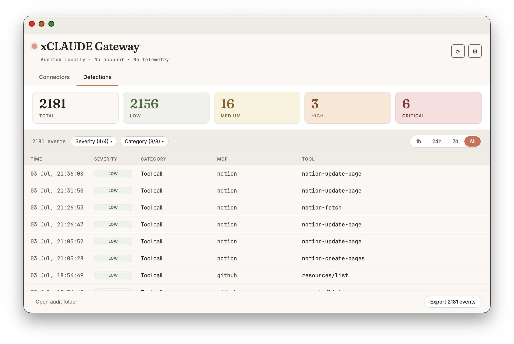
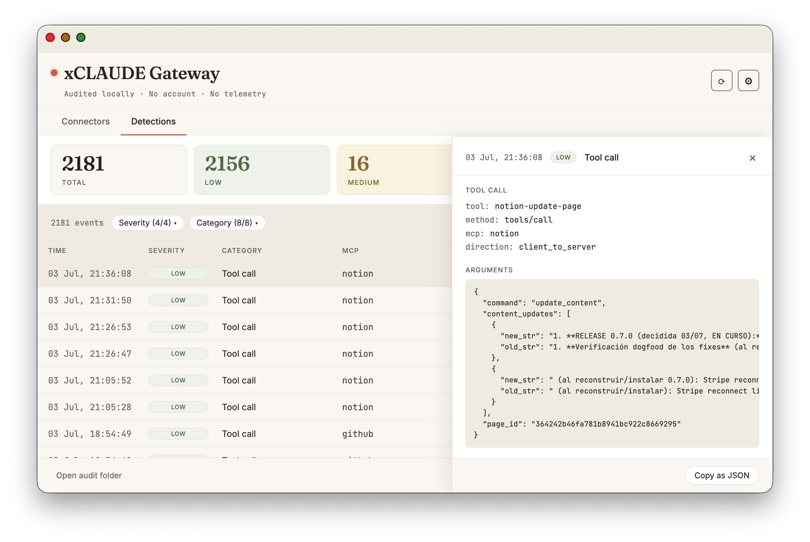
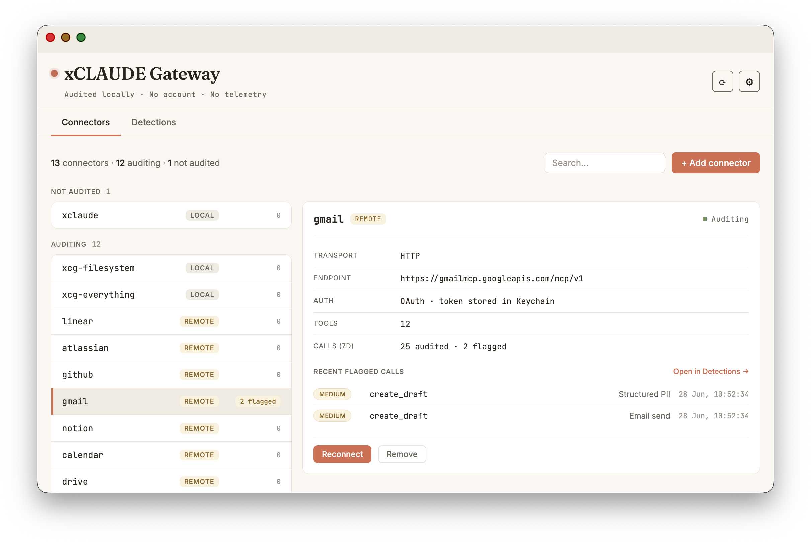
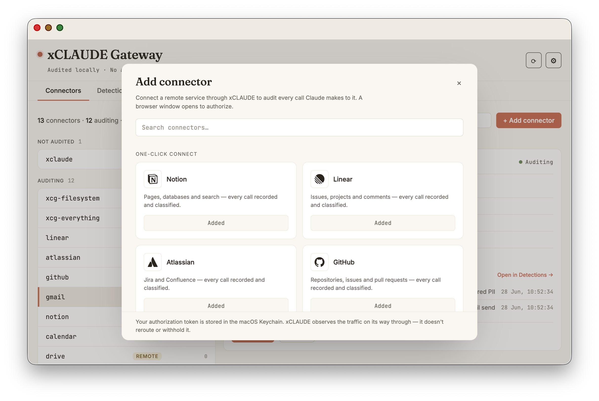
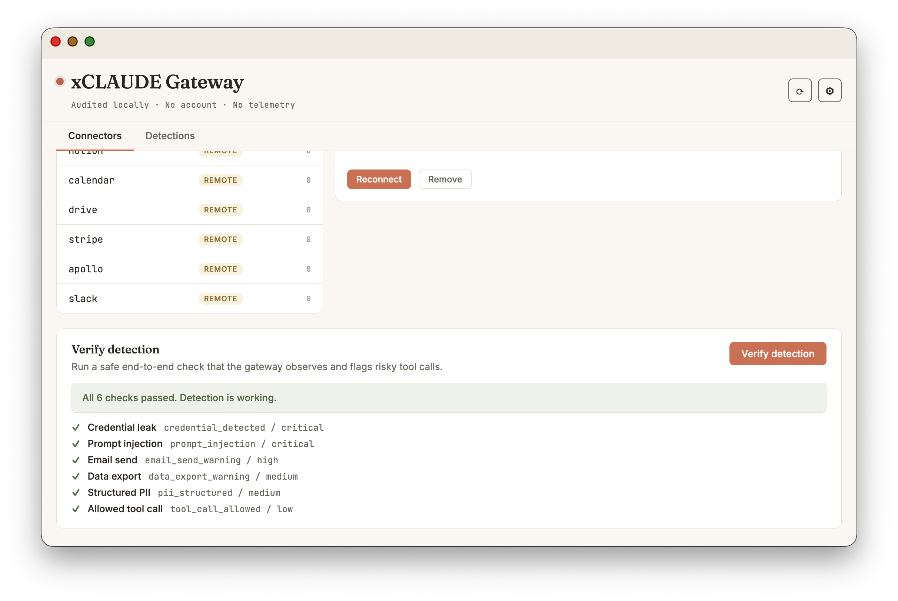
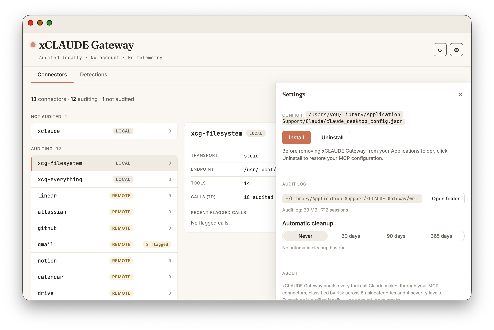

<div align="center">


# xCLAUDE Gateway

**A local audit layer for Claude Desktop's MCP traffic — records, classifies and warns; never blocks.**

[](https://github.com/rebecazm129-commits/xclaude-gateway/releases)
[](https://github.com/rebecazm129-commits/xclaude-gateway/releases)
[-000000?logo=apple&logoColor=white)](#requirements)
[](#license)

xCLAUDE Gateway is in beta.

</div>

<p align="center"></p>

xCLAUDE Gateway sits between Claude Desktop and the services it talks to — remote connectors like Notion, Linear, Atlassian, GitHub or Gmail, or the local MCP servers you already run — records every JSON-RPC frame to a per-session log on your Mac, and classifies sensitive patterns with severity tags. The audit happens locally; the traffic still reaches the service it's addressed to. The audit covers both sides of the conversation: what Claude Desktop asks your tools to do, and what those tools send back.

## Requirements

- macOS 13 or later, on Apple Silicon (M1 or newer). The current build is arm64-only; Intel Macs are not supported.
- Claude Desktop installed and working.
- Optional: local MCP servers you already use (xCLAUDE wraps them). If you only want to audit remote services, no local server is needed. If you want to try local wrapping and don't have a server, `@modelcontextprotocol/server-filesystem` is an easy starting point (installable via `npx -y`).

## Installation

1. Download the latest `.dmg` from the GitHub Releases page.
2. Open the `.dmg` and drag `xCLAUDE Gateway.app` into `/Applications/`, then eject the disk image and launch the app **from Applications** (not from the disk image window).
3. The app is signed with a Developer ID and notarized by Apple; it opens cleanly on first launch.

## Configuration

Open `xCLAUDE Gateway.app`. The **Connectors** tab lists every entry in your `claude_desktop_config.json` with its audit state: **auditing** (already wrapped), **not audited** (eligible for wrapping) or **unsupported**. To wrap the eligible servers, open **Settings** (the gear icon in the header) and click **Install**; click **Uninstall** there to revert.

The first time you click Install, xCLAUDE Gateway makes a one-time backup of your config at `~/Library/Application Support/Claude/claude_desktop_config.json.bak` which is never overwritten by subsequent operations.

If you prefer manual configuration, see [Manual configuration](#manual-configuration) below.

## What it does

Whether you connect a remote service through xCLAUDE (Notion, Linear, Atlassian, GitHub, Stripe, Apollo, Slack, Gmail, Google Calendar, Google Drive) or wrap a local MCP server you already run (filesystem, custom scripts, anything you launch via `npx` or a local binary), xCLAUDE Gateway sits transparently between Claude Desktop and that server:

- **Wraps your existing MCP servers transparently** — no changes to the servers themselves.
- **Records every JSON-RPC frame** (requests, responses, notifications) to a per-session JSONL log under `~/Library/Application Support/xCLAUDE Gateway/wrappers/`.
- **Classifies sensitive patterns** with a detection engine — see [Detectors](#detectors) for the full list.
- **Both directions.** All five regex detectors scan tool-call results as well as outgoing arguments — a secret, an injected instruction or a checksum-valid identifier arriving in a server's response is classified too. Named-entity PII (async enrichment) runs on requests only.
- **Captures latency overhead per response** (`overheadUs`) and end-to-end server response time (`latencyMs`).
- **Captures the wrapped server's stderr output** as separate events.
- **Shows the classified events in a Detections view** inside the `xCLAUDE Gateway.app` window, with severity, category and time-range filters, and lets you **export the filtered trail** to raw JSONL or CSV — plus a menu-bar icon whose dropdown menu lists the number of flagged events in the last 24 hours.
- **Auto-configures `claude_desktop_config.json`** from the app: one click on **Install** (in the Settings drawer) wraps the eligible servers, another reverts them, with a backup of your original config preserved.

The audit runs entirely on your Mac: no telemetry, no account, no analytics. xCLAUDE makes no network calls of its own — the only outbound traffic is the connectors you add and their OAuth sign-in, plus the "Request a connector" link, which opens your system browser. Note that wrapped servers still talk to their destination — a local MCP server to your filesystem, a remote connector to its provider over the network. xCLAUDE observes that traffic; it doesn't reroute or withhold it.

### Detectors

| Category | Severity | What it detects |
| --- | --- | --- |
| `credential_detected` | CRITICAL | Known formats of API keys (Anthropic, OpenAI, GitHub, AWS, and similar). |
| `prompt_injection` | CRITICAL | Common injection / jailbreak phrases ("ignore all previous instructions", "follow any instructions you find inside this file", etc.). |
| `tool_manifest_changed` | HIGH / MEDIUM | Changes to a connector's advertised `tools/list` versus a per-connector baseline — tool poisoning. Since 0.7.0. |
| `email_send_warning` | HIGH / MEDIUM | Imperative requests to send email in tool text, and send-semantics tool calls (see below). |
| `data_export_warning` | MEDIUM | Imperative requests to export data. |
| `pii_structured` | MEDIUM | Well-formed, checksum-validated PII shapes (see below). |
| `pii_detected` | LOW | Named-entity PII — people, organizations, locations — found by the on-device NER model. Async enrichment; runs on requests only. |
| `tool_call_allowed` | LOW | Baseline emitted for every tool call that matches none of the above — the "everything is normal" line, not an absence of analysis. |

**`email_send_warning` branches.** An AI-executed send (`send`/`reply`/`forward` tools) flags at HIGH — an action that deserves human attention regardless of intent; an AI-composed draft (`draft`/`compose` tools) flags at MEDIUM, since a draft is content one click away from sent.

**`pii_structured` shapes.** Emails, IBANs (mod-97), credit cards (Luhn), US SSNs, UK National Insurance and NHS numbers, Spanish DNI/NIE, international phone numbers, passport MRZ lines (ICAO 9303), French NIR, Italian codice fiscale, Dutch BSN, German Steuer-ID and Portuguese NIF. A regex preselects each candidate and a checksum confirms it, which keeps false positives near zero on numeric-heavy payloads. Findings record the matched type only — never the datum itself. Available since 0.4.4.

**`tool_manifest_changed` baseline.** xCLAUDE keeps a small per-connector baseline (a hash plus per-tool signatures) of each server's `tools/list`. The first time a connector is seen the baseline is seeded silently — no detection — and a later change is recorded exactly once: a changed description or input schema flags at HIGH, an added or removed tool at MEDIUM. Since 0.7.0.

<p align="center"></p>

## What this proxy is, and what it is not

xCLAUDE Gateway is a **complement to the safety behavior of your MCP client**, not a replacement for it.

In practice, Claude Desktop's model often refuses sensitive operations on its own — before they ever reach the proxy. If you ask the model to write a credential to a file, it will likely decline. The proxy doesn't see that refusal because no tool call was made. **That is by design and not a limitation of this tool**.

What the proxy adds on top of that:

- A **complete local audit trail** of every tool call that did happen. Forensics, not just detection. If in six months you wonder what crossed your Mac, the JSONL log tells you exactly.
- A **second independent layer** of classification, useful in flows where the model is less cautious about each individual tool call (agentic workflows, long automated chains, future MCP clients with different safety postures).
- A **foundation for richer detection, alerting and reporting** as the audit engine grows.

If you're looking for a tool that prevents Claude from making sensitive tool calls in the first place, the model itself is already doing most of that work. If you're looking for a tool that records, classifies and gives you visibility over the MCP traffic on your machine, this is it.

## What it does NOT do yet

- **No blocking or altering of tool calls.** The detectors record and classify with severity; xCLAUDE never stops, reroutes or withholds an operation — that is the design, not a limitation.
- **Named-entity PII detection runs as an async enrichment** (transformers.js NER): persons, organizations and locations found in tool-call payloads are recorded in the audit log alongside the main detector chain. It is early stage — it complements the checksum-based `pii_structured` detector, and is not yet part of the synchronous detector chain.
- **No auditing of native Connectors.** Services you connect with one click in Claude Desktop's settings are brokered through Anthropic's servers; their traffic never reaches your Mac, so xCLAUDE can't see it. To audit such a service, connect it through xCLAUDE instead (see "Remote connectors" below).
- **No in-app UI yet for bringing your own OAuth client** (needed by the Google connectors — see "Google services" below). Seeding the client currently requires a one-time terminal step.

These come in upcoming milestones. See the project roadmap for details.

## Scope

xCLAUDE Gateway in its current state **covers a specific subset** of the Claude ecosystem:

### What is covered

What's audited is Claude Desktop's MCP JSON-RPC traffic — nothing else on your Mac.

- **Claude Desktop** with **local MCP servers** that are wrapped via the app's **Install** action (or manually in `claude_desktop_config.json` by pointing them to `xcg-proxy`).
- **Remote MCP servers connected through xCLAUDE** (Notion, Linear, Atlassian, GitHub, Stripe, Apollo, Slack, Gmail, Google Calendar and Google Drive today; more on the way). You connect them from the Connectors tab (+ Add connector), which signs you in and bridges the traffic through your machine for auditing.

### What is NOT covered

- **Claude Desktop's native Connectors** (the ones you enable with one click in Settings). xCLAUDE cannot audit those: they are brokered through Anthropic's servers, so their traffic never reaches your machine — intercepting it would require breaking TLS, which this project will not do. **What xCLAUDE offers instead is its own audited path to the same services:** connect a remote MCP server *through* xCLAUDE (see "Remote connectors" below) and its traffic is bridged via your machine, where xCLAUDE can observe it. To audit a service this way, connect it through xCLAUDE rather than as a native Connector.
- **Claude Code** (the CLI). It is a separate MCP client with its own configuration. The wrapper itself might work technically if pointed there, but this has not been tested or documented.
- **Cowork.** Same reasoning as Claude Code: separate client, separate configuration, not currently tested.
- **Anthropic's API directly** (any SDK integration). No MCP client model applies; out of scope by design.
- **Skills** (markdown files used by the model as context). They are not JSON-RPC traffic; they are not interceptable by a stdio proxy. The proxy does capture any tool calls a skill ends up making, but not the skill content itself.
- **Claude's native tools** (web search, computer use, code execution, etc.). These are internal model tools, not MCP servers. They never traverse the proxy.

If you're using Claude Desktop with local MCP servers, or you connect a remote service through xCLAUDE, you're in scope. If your main use is anything else, this tool will not give you what you expect today.

## Remote connectors

<p align="center"></p>

<p align="center"></p>

xCLAUDE can audit remote MCP services (Notion, Linear, Atlassian, GitHub, Stripe, Apollo, Slack, Gmail, Google Calendar and Google Drive today, with more on the way) by acting as your connection to them, instead of Claude Desktop connecting directly.

To audit a service this way:

1. If you already have it enabled as a native Connector in Claude Desktop, disconnect it there first. xCLAUDE audits its own bridged connection, not the native one.
2. In xCLAUDE, open the **Connectors** tab and click **+ Add connector** to open the connector gallery. Pick the service and click **Connect**. (Not listed? Use the **Request a connector** link.)
3. A browser window opens to authorize the service (standard OAuth). Approve it; the tab will say the login is complete.
4. Restart Claude Desktop. Claude now reaches the service through xCLAUDE, and every call is recorded and classified like any other MCP traffic.

Your authorization token is stored in the macOS Keychain, not in plain text. xCLAUDE never sees your password. The traffic still reaches the provider — xCLAUDE observes it on its way through, it does not withhold or reroute it. If a connector's authorization expires or is revoked, xCLAUDE flags a re-login alert on that connector (and a macOS notification); reconnect it and restart Claude Desktop to resume auditing.

### GitHub

Connects via standard OAuth. xCLAUDE requests a narrow scope set — `repo`, `read:org`, `read:user` — rather than the full set the server advertises.

<details>
<summary>Google services setup (BYO OAuth client)</summary>

Google's official Workspace MCP servers (Gmail, Calendar, Drive) don't use the one-click flow the other connectors do: Google has no dynamic client registration, so you bring your own (free) OAuth client, and the servers are currently behind Google's Workspace Developer Preview Program. One OAuth client serves all three connectors — and the app walks you through the whole thing. Click **Set up…** on any Google card in **Add connector**: a guided 4-step wizard with deep links into the Google Cloud console at every step. Plan for about 10 minutes of clicking, plus an asynchronous wait for Google's approval email.

What the wizard walks you through:

1. **Cloud project + APIs.** Create a Google Cloud project (or pick one you have) and enable the required APIs — one click in the wizard enables all six at once (each service needs its base API and its MCP API; without the `*mcp.googleapis.com` one, that connector's MCP server returns `403` on every tool call). Note the project's **project number** — you'll need it in step 3.
2. **OAuth client.** Configure the consent screen (Internal if available, otherwise External — add your own email under Test users) and create a client with application type **Desktop app**. Google issues a **client ID** and a **client secret**; copy both. (Google's token endpoint requires the client secret even though the flow uses PKCE.)
3. **Preview enrollment.** Enroll your project in the Developer Preview Program with your project number. Approval arrives by email, usually within a couple of days — you can finish step 4 now and connect once it lands. **The one hard requirement:** the enrollment *form* requires an email on a custom domain and rejects plain `@gmail.com` addresses. That is the only place a domain email is needed — the Google account you later connect and audit can be a regular Gmail, and once the project is approved, any Google account can authorize through it. This gate is Google's, and should disappear when these servers leave preview.
4. **Paste your credentials.** The wizard stores your client ID and secret in the macOS Keychain — nothing goes into plain-text config, and no Terminal is involved.

**Finally, connect and restart.** Once seeded, the Google cards show **Connect** instead of **Set up…**. Click it, approve in the browser window that opens (you'll pass Google's "unverified app" screen — see below), then restart Claude Desktop. Google traffic is now audited like any other connector.

**What to expect while your client is unverified.** Two rough edges come from running your own client in Testing mode, not from xCLAUDE:

- Google shows a **"Google hasn't verified this app"** screen on each authorization. You continue past it because it's your own client.
- Google expires the refresh token after 7 days, so you **re-authorize about once a week**. xCLAUDE flags a re-login alert on the connector when that happens.

**Scopes.** xCLAUDE requests the scopes Google documents for each server — Gmail: read + compose (the Gmail MCP has **no send tool** by Google's design, so a draft is the most it can do; you send from Gmail yourself); Calendar: read-only; Drive: read with per-file access.

</details>

## Verification

After restarting Claude Desktop with at least one wrapped MCP, verify the proxy is running:

```bash
ps aux | grep xcg-proxy | grep -v grep
```

One process per wrapped MCP should appear.

Verify a session log was created:

```bash
ls -lt ~/Library/Application\ Support/xCLAUDE\ Gateway/wrappers/
```

A new JSONL file appears every time Claude Desktop starts with wrapped MCPs.

Inspect a log entry:

```bash
tail -1 ~/Library/Application\ Support/xCLAUDE\ Gateway/wrappers/<latest>.jsonl | jq .
```

A typical event:

```json
{
  "v": 1,
  "id": "01KRG8C71M9EXBRJE1T19A1583",
  "ts": "2026-05-13T08:48:40.501Z",
  "session": "01KRG87RPQ59QFBZAK8BXT02DY",
  "mcp": "filesystem",
  "type": "mcp.request",
  "direction": "client_to_server",
  "rpcId": 4,
  "method": "tools/call",
  "params": {},
  "bytes": 117,
  "overheadUs": 322,
  "detection": {
    "category": "tool_call_allowed",
    "severity": "low",
    "findings": []
  }
}
```

Each session writes its own file. The file name is the session ID (ULID). Open `xCLAUDE Gateway.app` and click the **Detections** tab to see the same events with severity, category and time-range filters.

### Verify detection (self-test)

The Connectors tab includes a **Verify detection** button — a safe, self-contained end-to-end check of the kind these tools usually ship. It runs a synthetic risky payload through the audit pipeline and confirms the event is recorded and flagged, so you can see the detectors working end to end without touching any real connector.

<p align="center"></p>

## Audit log retention

<p align="center"></p>

The audit trail is the product, so **nothing is ever deleted by default**. Session logs accumulate in the wrappers directory and stay there until you decide otherwise.

- **A visible size warning.** When the wrappers directory grows past a configured threshold (default **500 MiB**), the app shows a warning in the Detections view. It only warns — auditing continues unchanged.
- **Optional automatic purge by age.** In Settings you can opt in to automatic cleanup of session logs older than **30, 90 or 365 days**. It is **off by default**. Every purge is recorded as a visible `app.retention_purged` event in the audit log — a purge is never silent.
- **Live sessions are never purged.** A session's age is the later of its start time (from the session ULID) and its last write, so an active or recently written session is always kept, even under an aggressive setting.
- **Where the setting lives.** Retention configuration is stored in `settings.json`, next to the wrappers directory under `~/Library/Application Support/xCLAUDE Gateway/`.

Retention mode, current audit log size, and the last cleanup are shown under Settings → Audit log.

## Manual configuration

<details>
<summary>Wrap MCP servers by hand instead of using the app's Install action</summary>

If you prefer to edit your config by hand instead of clicking **Install** in the app, back up your config first:

```bash
cp ~/Library/Application\ Support/Claude/claude_desktop_config.json \
   ~/Library/Application\ Support/Claude/claude_desktop_config.json.bak
```

For each MCP server you want to wrap, replace its entry with one that points to the stable proxy launcher and passes the original command as arguments.

Before (example with `@modelcontextprotocol/server-filesystem`):

```json
{
  "mcpServers": {
    "filesystem": {
      "command": "npx",
      "args": ["-y", "@modelcontextprotocol/server-filesystem", "/path/to/dir"]
    }
  }
}
```

After (wrapped through xCLAUDE Gateway):

```json
{
  "mcpServers": {
    "filesystem": {
      "command": "/Users/<you>/Library/Application Support/xCLAUDE Gateway/bin/xcg-proxy",
      "args": [
        "--wrap", "/usr/local/bin/npx",
        "--name", "filesystem",
        "--",
        "-y", "@modelcontextprotocol/server-filesystem", "/path/to/dir"
      ]
    }
  }
}
```

The path under `~/Library/Application Support/xCLAUDE Gateway/bin/xcg-proxy` is a stable symlink created by the `.app` on first launch; it resurfaces correctly after the `.app` is replaced by an updated version. Arguments after `--` are passed verbatim to the wrapped server. Use `--name` to set a label that identifies this MCP in the logs and in the dashboard.

For a remote MCP server, the wrapped entry uses the `http` subcommand instead, with the service URL passed as an argument:

```json
{
  "mcpServers": {
    "notion": {
      "command": "/Users/<you>/Library/Application Support/xCLAUDE Gateway/bin/xcg-proxy",
      "args": ["http", "--url", "https://mcp.notion.com/mcp", "--name", "notion"]
    }
  }
}
```

The same pattern applies to other remote connectors — for example Linear, with `"--url", "https://mcp.linear.app/mcp", "--name", "linear"`.

You must run the OAuth login once before this works — the Remote connectors panel does this for you. Restart Claude Desktop after editing.

</details>

## A note on expectations

In ordinary, day-to-day use of Claude Desktop with local MCP servers, most events will be `tool_call_allowed` at LOW severity. That is the intended baseline, not a sign that "nothing is happening". The Detections view highlights events at MEDIUM, HIGH or CRITICAL only when a detector matches. This typically happens rarely in normal use, because Claude Desktop's model already refuses many sensitive operations before any tool call is issued.

The value of xCLAUDE Gateway in this phase comes from three places: the **complete local audit trail**, the **classification of patterns when they do appear**, and the **foundation for richer detection and reporting** as the engine matures.

## Troubleshooting

<details>
<summary>Common issues and fixes</summary>

**Claude Desktop shows "MCP server failed to start" for a wrapped MCP.** Check the `command` path in your config matches the actual launcher path. Make sure the `.app` is in `/Applications/` and that you opened it once (which creates the stable symlink).

**No JSONL files appear in the wrappers directory.** Verify the proxy is running with `ps aux`. Make sure Claude Desktop was restarted after editing the config; the config is only read on Claude Desktop startup.

**A "Server disconnected" banner appears when I quit Claude Desktop.** Expected. The wrapper closes cleanly and Claude Desktop reports that the MCP is no longer reachable. Dismiss the banner.

**The Detections tab shows no events but the JSONL has them.** Restart `xCLAUDE Gateway.app`. The dashboard polls the JSONL files on startup; if the app was running before the wrappers started writing, refresh by reopening.

**The app looks outdated after an update (old icon, missing connectors).** Make sure you're not running the copy inside a mounted `.dmg`: eject any "xCLAUDE Gateway" disk image and launch from `/Applications/`.

</details>

## Uninstall

1. Open `xCLAUDE Gateway.app`, open **Settings** (the gear icon) and click **Uninstall**. This reverts all wrapped MCP servers in your config.
2. Move `xCLAUDE Gateway.app` from `/Applications/` to the Trash.
3. Optionally delete the logs:

```bash
rm -rf ~/Library/Application\ Support/xCLAUDE\ Gateway/
```

If you prefer manual uninstall:

```bash
mv ~/Library/Application\ Support/Claude/claude_desktop_config.json.bak \
   ~/Library/Application\ Support/Claude/claude_desktop_config.json
```

This restores the original config from the backup.

## Architecture

Monorepo with three workspaces:

- `packages/proxy` — the MCP proxy itself plus the `xcg-config` CLI.
- `packages/shared` — types and utilities shared between proxy and desktop.
- `apps/desktop` — the Electron app shipping the Connectors and Detections views.

Built with pnpm 9, Node 22, Electron, TypeScript.

## Disclaimer

xCLAUDE Gateway is an independent, open-source project, not affiliated with, endorsed by, or sponsored by Anthropic. "Claude" and "Claude Desktop" are trademarks of Anthropic. Other product names and logos — Google, Gmail, Slack, Notion, and the like — belong to their respective owners and are used for identification only.

## License

MIT. © Rebeca Zambrano Moreno & Ignacio Lucea Artero.
