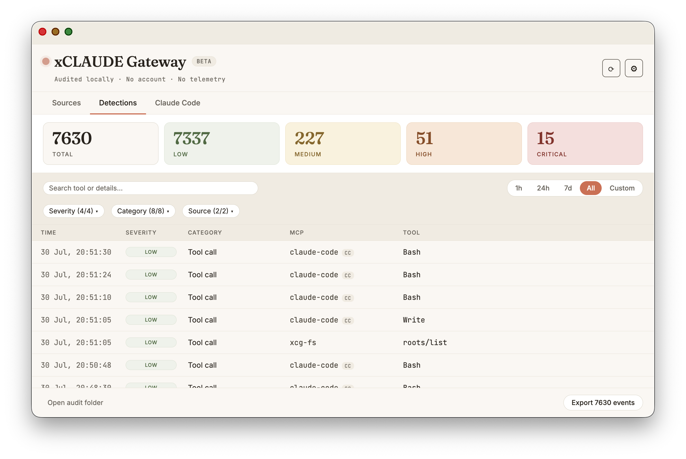
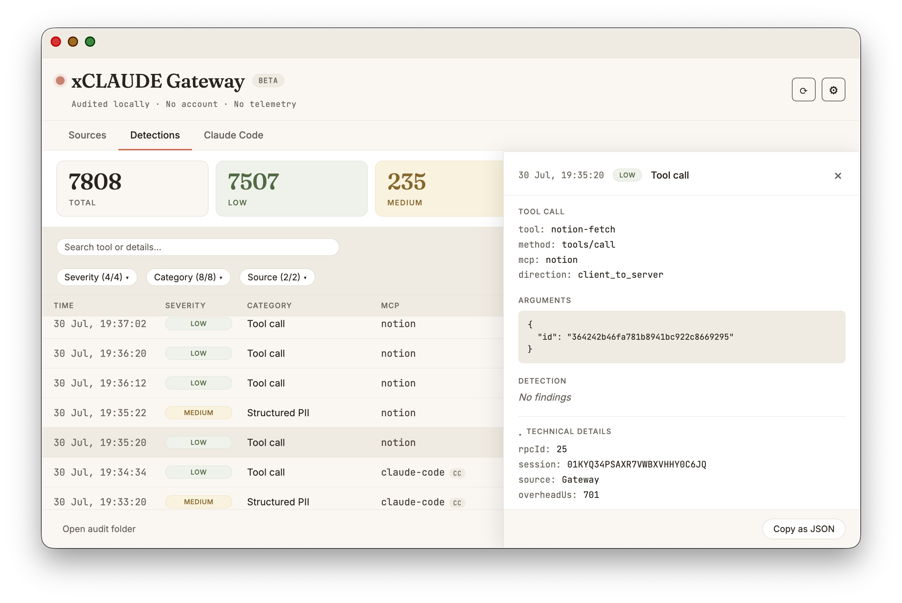
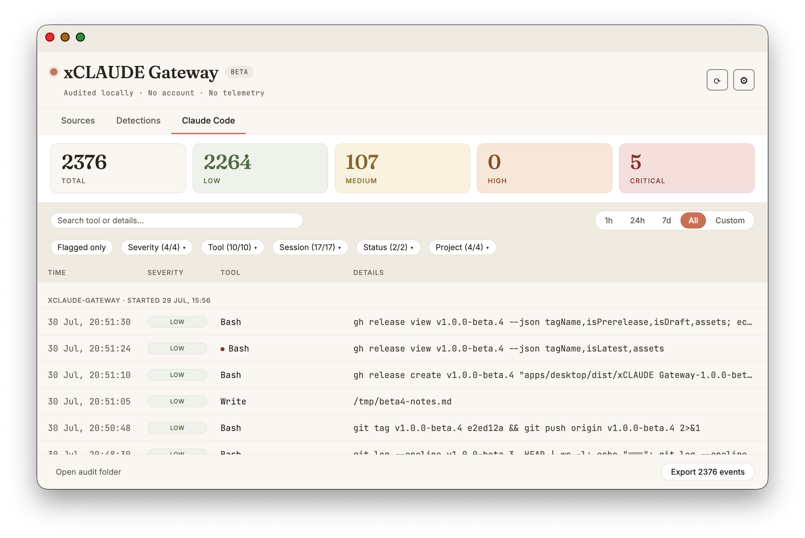
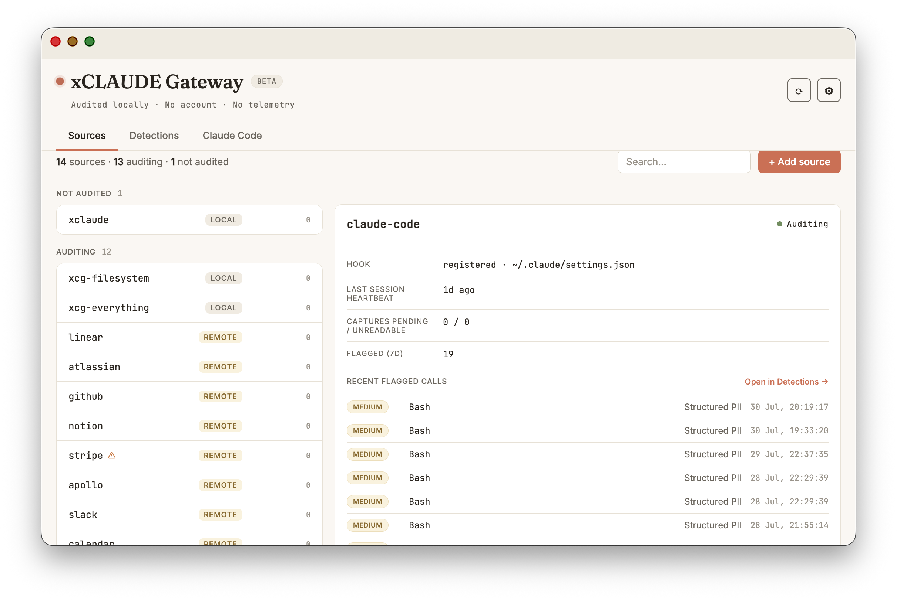
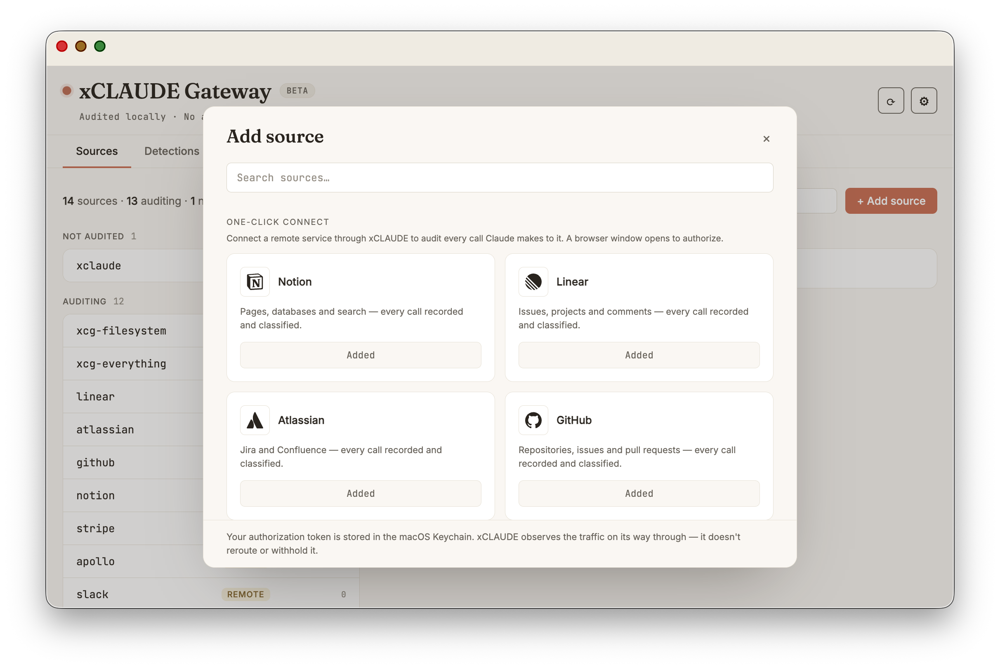
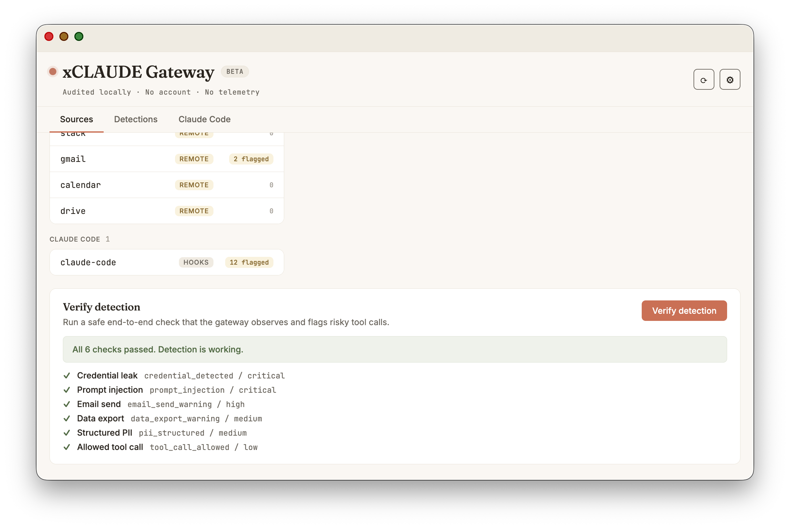
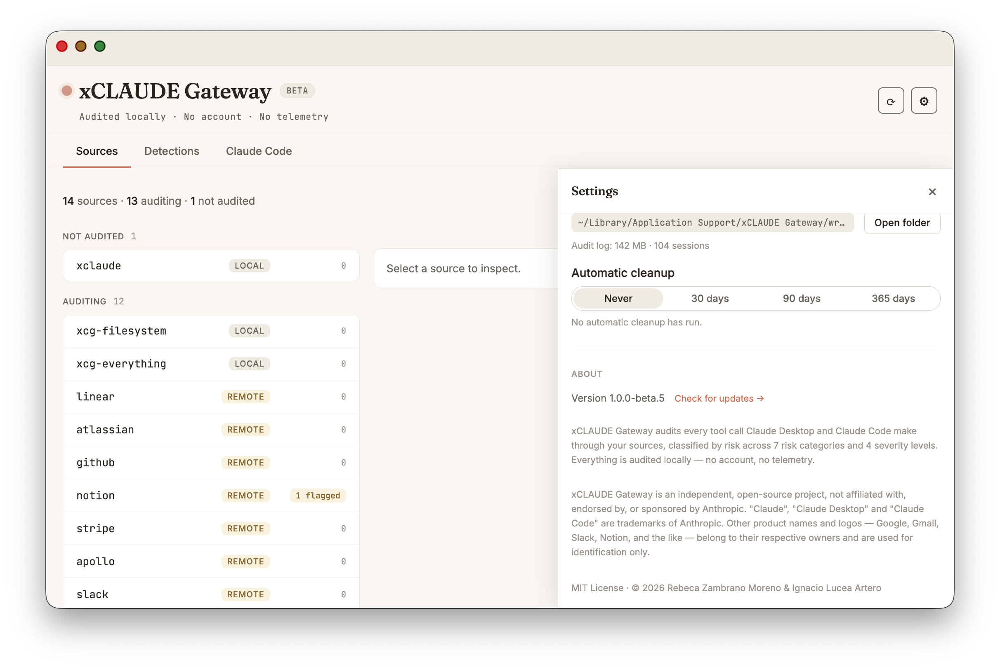

<div align="center">


# xCLAUDE Gateway

**A durable audit trail for Claude's tool activity.**

[](https://github.com/rebecazm129-commits/xclaude-gateway/actions/workflows/ci.yml)
[](https://github.com/rebecazm129-commits/xclaude-gateway/releases)
[](https://github.com/rebecazm129-commits/xclaude-gateway/releases)
[-000000?logo=apple&logoColor=white)](#installation)
[](#license)

xCLAUDE records and classifies tool activity from Claude Code and wrapped MCP servers — locally on your Mac, in a record you control.

Keep a reviewable history across sessions, spot activity worth a second look, and audit wrapped MCP servers in Claude Desktop too.

No account. No telemetry. Nothing sent to xCLAUDE.

macOS 13+ · Apple Silicon · Open source · MIT

**[Download xCLAUDE](https://github.com/rebecazm129-commits/xclaude-gateway/releases)** · **[xclaude.ai](https://xclaude.ai)**

</div>

<p align="center"></p>

<p align="center"><em>Tool activity, classified and kept — with severity, category and source.</em></p>

## Why xCLAUDE?

The more autonomy you give Claude, the harder it becomes to remember exactly what happened across tools, sessions and clients.

xCLAUDE keeps that activity in one local, reviewable trail. Most calls will be ordinary. When something deserves a second look — a credential, PII, a prompt-injection pattern, a data-export or email-send request, or a changed MCP tool manifest — xCLAUDE flags it.

It audits. It doesn't block.

## What you get

- **One reviewable history.** A **Detections** view over every recorded event, with severity, category, source and time-range filters — plus a dedicated **Claude Code** view grouped by session and project.
- **Classification with severity.** Eight categories, from `credential_detected` at CRITICAL down to the `tool_call_allowed` baseline — see [Detectors](#detectors).
- **The record stays yours.** Append-only JSONL under your own home directory, exportable to raw JSONL or CSV from the app.
- **Credential masking.** Values the credential detector recognizes are masked before they are written.
- **A menu-bar summary.** A dropdown listing the number of flagged events in the last 24 hours.
- **A self-test.** A **Verify detection** button that runs a synthetic risky payload end to end, so you can confirm the pipeline works without touching a real connector.

## What it sees

| Surface | Audited? |
| --- | --- |
| Claude Code tool calls | ✅ |
| Wrapped local MCP servers (Claude Code) | ✅ |
| Remote MCP servers connected through xCLAUDE | ✅ |
| Wrapped MCP servers in Claude Desktop | ✅ |
| Claude Desktop native connectors | ❌ |
| Claude Desktop built-in tools | ❌ |
| Conversations / Claude reasoning | ❌ |

Two limits worth stating up front:

- **Claude Code events are recorded after each call completes,** so a tool call that never finishes may leave no event.
- **Detector coverage is not identical on both paths.** Two detectors — `pii_detected` (on-device NER) and `tool_manifest_changed` — run only on wrapped MCP traffic, not on Claude Code events. Everything else runs on both.

xCLAUDE is an audit trail for tool activity, not a transcript of your conversation with Claude.

## Local by design

- **No account.** Nothing to sign up for.
- **No telemetry, no analytics.** xCLAUDE makes no network calls of its own. The only outbound traffic is the connectors you add and their OAuth sign-in, plus the "Request a connector" link, which opens your system browser.
- **Nothing is sent to xCLAUDE.** There is no server on our side to send it to.
- **The logs stay on your Mac,** under `~/Library/Application Support/xCLAUDE Gateway/`.
- **Nothing is deleted by default.** Retention is `never` out of the box; automatic purge by age is opt-in and configurable — see [Audit log retention](#audit-log-retention).
- **Credentials are masked before they are written.** When the `credential_detected` detector matches, the value never reaches the log in the clear.

One consequence to take seriously: **everything else is stored as captured.** Tool arguments and results are written verbatim, including any PII in them that no detector masked. Treat the audit trail as sensitive material — it is a faithful record of what your tools handled.

Wrapped servers still talk to their destination — a local MCP server to your filesystem, a remote connector to its provider over the network. xCLAUDE observes that traffic; it doesn't reroute or withhold it.

## Installation

**Requirements**

- macOS 13 or later, on Apple Silicon (M1 or newer). The current build is arm64-only; Intel Macs are not supported.
- Claude Desktop, Claude Code, or both — either one alone is enough. Claude Desktop's MCP servers are wrapped by the proxy; Claude Code is audited natively via a session hook (its local MCP servers can be wrapped too).
- Optional: local MCP servers you already use (xCLAUDE wraps them). If you only want to audit remote services, no local server is needed. If you want to try local wrapping and don't have a server, `@modelcontextprotocol/server-filesystem` is an easy starting point (installable via `npx -y`).

**Install**

1. Download the latest `.dmg` from the [latest GitHub release](https://github.com/rebecazm129-commits/xclaude-gateway/releases/latest).
2. Open the `.dmg` and drag `xCLAUDE Gateway.app` into `/Applications/`, then eject the disk image and launch the app **from Applications** (not from the disk image window).
3. The app is signed with a Developer ID and notarized by Apple; it opens cleanly on first launch.

**First run**

Open `xCLAUDE Gateway.app`. The **Sources** tab lists every entry in your `claude_desktop_config.json` with its audit state: **auditing** (already wrapped), **not audited** (eligible for wrapping) or **unsupported**. To wrap the eligible servers, open **Settings** (the gear icon in the header) and click **Install**; click **Uninstall** there to revert.

The first time you click Install, xCLAUDE Gateway makes a one-time backup of your config at `~/Library/Application Support/Claude/claude_desktop_config.json.bak` which is never overwritten by subsequent operations.

If you prefer manual configuration, see [Manual configuration](#manual-configuration) below.

## How the audit works

Whether you connect a remote service through xCLAUDE (Notion, Linear, Atlassian, GitHub, Stripe, Apollo, Slack, Gmail, Google Calendar, Google Drive) or wrap a local MCP server you already run (filesystem, custom scripts, anything you launch via `npx` or a local binary), xCLAUDE Gateway sits transparently between the client and that server:

- **Wraps your existing MCP servers transparently** — no changes to the servers themselves.
- **Records every JSON-RPC frame** (requests, responses, notifications) to a per-session JSONL log under `~/Library/Application Support/xCLAUDE Gateway/wrappers/`.
- **Classifies sensitive patterns** with a detection engine — see [Detectors](#detectors) for the full list.
- **Both directions.** All five regex detectors scan tool-call results as well as outgoing arguments — a secret, an injected instruction or a checksum-valid identifier arriving in a server's response is classified too. Named-entity PII (async enrichment) runs on requests only.
- **Captures latency overhead per response** (`overheadUs`) and end-to-end server response time (`latencyMs`).
- **Captures the wrapped server's stderr output** as separate events.
- **Lets you export the filtered trail** to raw JSONL or CSV from the Detections view.
- **Auto-configures `claude_desktop_config.json`** from the app: one click on **Install** (in the Settings drawer) wraps the eligible servers, another reverts them, with a backup of your original config preserved.

Claude Code is audited on a different path: a session hook registered in `~/.claude/settings.json` reports every tool call after it runs. Detection and credential masking apply to that stream too — see [Claude Code](#claude-code).

### Detectors

| Category | Severity | What it detects |
| --- | --- | --- |
| `credential_detected` | CRITICAL | Known formats of API keys (Anthropic, OpenAI, GitHub, AWS, and similar). |
| `prompt_injection` | CRITICAL | Four families of injection / jailbreak phrasing: instruction override ("ignore all previous instructions"), role override ("act as an unrestricted…"), system-prompt extraction ("reveal your system prompt") and jailbreak markers ("DAN mode", "do anything now"). |
| `tool_manifest_changed` | HIGH / MEDIUM | Changes to a connector's advertised `tools/list` versus a per-connector baseline — tool poisoning. Proxy path only. Since 0.7.0. |
| `email_send_warning` | HIGH / MEDIUM | Imperative requests to send email in tool text, and send-semantics tool calls (see below). |
| `data_export_warning` | MEDIUM | Imperative requests to export data. |
| `pii_structured` | MEDIUM | Well-formed PII shapes, checksum-confirmed where the format has a checksum (see below). |
| `pii_detected` | LOW | Named-entity PII — people, organizations, locations — found by the on-device NER model. Async enrichment; runs on requests only, proxy path only. |
| `tool_call_allowed` | LOW | Baseline emitted for every tool call that matches none of the above — the "everything is normal" line, not an absence of analysis. |

**`email_send_warning` branches.** An AI-executed send (`send`/`reply`/`forward` tools) flags at HIGH — an action that deserves human attention regardless of intent; an AI-composed draft (`draft`/`compose` tools) flags at MEDIUM, since a draft is content one click away from sent.

**`pii_structured` shapes.** Fifteen rules: emails, IBANs (mod-97), credit cards (Luhn), US SSNs, UK National Insurance and NHS numbers, Spanish DNI/NIE, E.164 phone numbers, passport MRZ line 2 (ICAO 9303 TD3), French NIR, Italian codice fiscale (standard form; omocodia variants are out of scope), Dutch BSN, German Steuer-ID and Portuguese NIF. A regex preselects each candidate and, for every shape that carries one, a checksum confirms it — which keeps false positives near zero on numeric-heavy payloads. Two shapes have no checksum to verify and match on their pattern alone: emails and E.164 phone numbers. Findings record the matched type only — never the datum itself. Available since 0.4.4.

**`tool_manifest_changed` baseline.** xCLAUDE keeps a small per-connector baseline (a hash plus per-tool signatures) of each server's `tools/list`. The first time a connector is seen the baseline is seeded silently — no detection — and a later change is recorded exactly once: a changed description or input schema flags at HIGH, an added or removed tool at MEDIUM. Since 0.7.0.

**Named-entity PII is early stage.** The transformers.js NER enrichment records persons, organizations and locations found in tool-call payloads alongside the main detector chain. It complements the checksum-based `pii_structured` detector and is not yet part of the synchronous detector chain. It will mature in upcoming releases.

<p align="center"></p>

### What to expect in normal use

In ordinary, day-to-day use, most events will be `tool_call_allowed` at LOW severity. That is the intended baseline, not a sign that "nothing is happening". The Detections view highlights events at MEDIUM, HIGH or CRITICAL only when a detector matches — which happens rarely in normal use, because Claude's own model already refuses many sensitive operations before any tool call is issued.

The value of xCLAUDE Gateway in this phase comes from three places: the **complete local audit trail**, the **classification of patterns when they do appear**, and the **foundation for richer detection and reporting** as the engine matures.

## How the audit trail is stored

- **Append-only.** Each line is one complete JSON envelope, appended to a per-session file under `~/Library/Application Support/xCLAUDE Gateway/wrappers/`. Nothing is rewritten in place.
- **Session files are compacted into day files.** Once a session ends, the compactor appends its lines to a file for that day (UTC) and removes the original. "One file per session" is therefore true while the session is live, not permanently.
- **Durability is page-cache backed.** There is no `fsync` per line — the fd is flushed on clean shutdown. The last writes before a power cut or a kernel panic are not absolutely guaranteed.
- **Claude Code events come from post-execution hooks.** They are recorded once the tool call has completed.
- **Credentials are masked; the rest is verbatim.** See below.
- **Nothing is purged by default** (`purgeMode = never`). See [Audit log retention](#audit-log-retention).

**Credential masking.** Detected credentials are the one deliberate exception to capture-all. When the `credential_detected` detector matches an API key or token, its value is masked before the event is written: a 10-character prefix plus an HMAC-SHA256 fingerprint, keyed by a random salt created once per install (`~/Library/Application Support/xCLAUDE Gateway/audit-salt`). The prefix keeps the row recognizable; the fingerprint is irreversible and verifies nothing outside your machine. The same salt keys both audit sources — wrapped MCP traffic and Claude Code — so one credential carries the same fingerprint wherever it appears, and masked events still correlate across sources. There is no toggle. Everything else is recorded as captured, including PII no detector masked (oversized values are size-truncated and flagged as such).

## Claude Code

<p align="center"></p>

Claude Code's activity — the tool calls in a session, built-in tools and MCP tools alike — is audited natively via a session hook (`PostToolUse` / `PostToolUseFailure`, matcher `*`, so every Claude Code tool is covered), with its own view in the app. Detection and credential masking run on this stream just as they do on wrapped traffic, keyed by the same salt.

The hook lives in `~/.claude/settings.json`, a file any program — including Claude Code itself — can edit. xCLAUDE does not prevent its removal; it makes it visible: if the hook disappears without an in-app Uninstall, the app warns, offers one-click reinstall, and records an `app.cchook_removed` marker in the audit trail.

<p align="center"></p>

### Wrapping Claude Code's MCP servers

The native Claude Code audit already records MCP tool calls and their results. Wrapping a server adds what only the protocol level can show: the server's tool manifest (`tools/list`, which feeds `tool_manifest_changed` — the rug-pull detector), the server's stderr, and server-initiated traffic such as `roots/list` requests.

Setup is manual for now (there is no Install button for Claude Code yet). Register the wrapped server with `claude mcp add-json` — don't edit Claude Code's config files by hand:

```
claude mcp add-json <name> '{"type":"stdio","command":"/Users/<you>/Library/Application Support/xCLAUDE Gateway/bin/xcg-proxy","args":["stdio","--wrap","<original-command>","--name","<name>","--","<original-args...>"],"env":{}}'
```

Replace `/Users/<you>` with your actual home directory — the quoted JSON will not expand `~` or `$HOME`. Then start a new Claude Code session. The `bin/xcg-proxy` path is a stable symlink the app maintains; it runs on the app's own runtime, so no Node installation is required. This registers the server for the current project; add `--scope user` to wrap it across all your projects. To revert, `claude mcp remove <name>` and re-add the server with its original command.

Notes: only local stdio servers can be wrapped — Claude Code's claude.ai-managed connectors are brokered remotely and never reach your machine, same as Claude Desktop's native Connectors. With both the wrapper and the native Claude Code audit active, each call on a wrapped server is recorded by both sources; the two records are correlated by Claude Code's tool-use ID: paired rows carry a link indicator in Detections, and the event detail names the other source.

## Remote connectors

<p align="center"></p>

xCLAUDE can audit remote MCP services (Notion, Linear, Atlassian, GitHub, Stripe, Apollo, Slack, Gmail, Google Calendar and Google Drive today, with more on the way) by acting as your connection to them, instead of Claude Desktop connecting directly.

To audit a service this way:

1. If you already have it enabled as a native Connector in Claude Desktop, disconnect it there first. xCLAUDE audits its own bridged connection, not the native one.
2. In xCLAUDE, open the **Sources** tab and click **+ Add source** to open the connector gallery. Pick the service and click **Connect**. (Not listed? Use the **Request a connector** link.)
3. A browser window opens to authorize the service (standard OAuth). Approve it; the tab will say the login is complete.
4. Restart Claude Desktop. Claude now reaches the service through xCLAUDE, and every call is recorded and classified like any other MCP traffic.

Your authorization token is stored in the macOS Keychain, not in plain text. xCLAUDE never sees your password. The traffic still reaches the provider — xCLAUDE observes it on its way through, it does not withhold or reroute it. If a connector's authorization expires or is revoked, xCLAUDE flags a re-login alert on that connector (and a macOS notification); reconnect it and restart Claude Desktop to resume auditing. If a connector disappears from your Claude Desktop config outside the app — another program rewrote the file — xCLAUDE flags it within seconds and offers to re-add it.

### GitHub

Connects via standard OAuth. xCLAUDE requests a narrow scope set — `repo`, `read:org`, `read:user` — rather than the full set the server advertises.

<details>
<summary>Google services setup (BYO OAuth client)</summary>

Google's official Workspace MCP servers (Gmail, Calendar, Drive) don't use the one-click flow the other connectors do: Google has no dynamic client registration, so you bring your own (free) OAuth client, and the servers are currently behind Google's Workspace Developer Preview Program. One OAuth client serves all three connectors — and the app walks you through the whole thing. Click **Set up…** on any Google card in **Add source**: a guided 4-step wizard with deep links into the Google Cloud console at every step. Plan for about 10 minutes of clicking, plus an asynchronous wait for Google's approval email.

What the wizard walks you through:

1. **Cloud project + APIs.** Create a Google Cloud project (or pick one you have) and enable the required APIs — one click in the wizard enables all six at once (each service needs its base API and its MCP API; without the `*mcp.googleapis.com` one, that connector's MCP server returns `403` on every tool call). Note the project's **project number** — you'll need it in step 3.
2. **OAuth client.** Configure the consent screen (Internal if available, otherwise External — add your own email under Test users) and create a client with application type **Desktop app**. Google issues a **client ID** and a **client secret**; copy both. (Google's token endpoint requires the client secret even though the flow uses PKCE.)
3. **Preview enrollment.** Enroll your project in the Developer Preview Program with your project number. Approval arrives by email, usually within a couple of days — you can finish step 4 now and connect once it lands. **The one hard requirement:** the enrollment *form* requires an email on a custom domain and rejects plain `@gmail.com` addresses. That is the only place a domain email is needed — the Google account you later connect and audit can be a regular Gmail, and once the project is approved, any Google account can authorize through it. This gate is Google's, and should disappear when these servers leave preview.
4. **Paste your credentials.** The wizard stores your client ID and secret in the macOS Keychain — nothing goes into plain-text config, and no Terminal is involved.

**Finally, connect and restart.** Once seeded, the Google cards show **Connect** instead of **Set up…**. Click it, approve in the browser window that opens (you'll pass Google's "unverified app" screen — see below), then restart Claude Desktop. Google traffic is now audited like any other connector.

**What to expect while your client is unverified.** Two things to know about running your own client — both are Google's behavior, not xCLAUDE's:

- Google shows a **"Google hasn't verified this app"** screen on each authorization. You continue past it because it's your own client.
- If you clicked **Publish app** on the consent screen (the path the in-app wizard recommends), you authorize once and you're done. If you left the project in testing instead, Google expires the refresh token after 7 days and you **re-authorize about once a week** — xCLAUDE flags a re-login alert on the connector when that happens.

**Scopes.** xCLAUDE requests the scopes Google documents for each server. **Gmail:** `gmail.modify`. Google's consent screen presents this as "Read, compose, and send emails from your Gmail account" — the permission you grant is broader than what the connector does. Google's Gmail MCP exposes no send tool, so drafting is the most Claude can do through xCLAUDE; the scope also covers moving mail to Trash and marking it as spam — only permanent deletion that bypasses Trash is excluded. **Calendar:** `calendar.events` (read and write events), plus `calendar.calendarlist.readonly` and `calendar.events.freebusy`. **Drive:** `drive.readonly` + `drive.file` — read, with per-file access.

</details>

## Verification

After restarting Claude Desktop with at least one wrapped MCP, verify the proxy is running:

```bash
ps aux | grep xcg-proxy | grep -v grep
```

One process per wrapped MCP should appear.

Verify a session log was created:

```bash
ls -lt ~/Library/Application\ Support/xCLAUDE\ Gateway/wrappers/
```

A new JSONL file appears every time Claude Desktop starts with wrapped MCPs. Its name is the session ID (ULID); once the session ends, the compactor folds it into that day's file.

Inspect a log entry:

```bash
tail -1 ~/Library/Application\ Support/xCLAUDE\ Gateway/wrappers/<latest>.jsonl | jq .
```

A typical event:

```json
{
  "v": 1,
  "id": "01KRG8C71M9EXBRJE1T19A1583",
  "ts": "2026-05-13T08:48:40.501Z",
  "session": "01KRG87RPQ59QFBZAK8BXT02DY",
  "mcp": "filesystem",
  "type": "mcp.request",
  "direction": "client_to_server",
  "rpcId": 4,
  "method": "tools/call",
  "params": {},
  "bytes": 117,
  "overheadUs": 322,
  "detection": {
    "category": "tool_call_allowed",
    "severity": "low",
    "findings": []
  }
}
```

Open `xCLAUDE Gateway.app` and click the **Detections** tab to see the same events with severity, category and time-range filters.

### Verify detection (self-test)

The Sources tab includes a **Verify detection** button — a safe, self-contained end-to-end check of the kind these tools usually ship. It runs a synthetic risky payload through the audit pipeline and confirms the event is recorded and flagged. The result shows in the **Sources** tab — the synthetic event does not create a row in Detections — so you can see the detectors working end to end without touching any real connector.

<p align="center"></p>

## Audit log retention

<p align="center"></p>

The audit trail is the product, so **nothing is ever deleted by default** (`purgeMode = never`). Session and day logs accumulate in the wrappers directory and stay there until you decide otherwise.

- **A visible size warning.** When the wrappers directory grows past a configured threshold (default **500 MiB**), the app shows a warning in the Detections view. It only warns — auditing continues unchanged.
- **Optional automatic purge by age.** In Settings you can opt in to automatic cleanup of session logs older than **30, 90 or 365 days**. It is **off by default**. Every purge is recorded as a visible `app.retention_purged` event in the audit log — a purge is never silent.
- **Live sessions are never purged.** A session's age is the later of its start time (from the session ULID) and its last write, so an active or recently written session is always kept, even under an aggressive setting.
- **Where the setting lives.** Retention configuration is stored in `settings.json`, next to the wrappers directory under `~/Library/Application Support/xCLAUDE Gateway/`.

Retention mode, current audit log size, and the last cleanup are shown under Settings → Audit log.

## Known limitations

xCLAUDE Gateway is a **complement to the safety behavior of your MCP client**, not a replacement for it. The full coverage map is in [What it sees](#what-it-sees); this section explains the edges.

**It never blocks or alters a tool call.** The detectors record and classify with severity; xCLAUDE never stops, reroutes or withholds an operation. In practice, Claude's model often refuses sensitive operations on its own — before they ever reach the proxy. If you ask the model to write a credential to a file, it will likely decline. The proxy doesn't see that refusal because no tool call was made. **That is by design and not a limitation of this tool.**

What the audit adds on top of that:

- A **durable local audit trail** of the tool activity xCLAUDE covers. Forensics, not just detection. If in six months you wonder what your audited tools handled, the JSONL log tells you.
- A **second independent layer** of classification, useful in flows where the model is less cautious about each individual tool call (agentic workflows, long automated chains, future MCP clients with different safety postures).
- A **foundation for richer detection, alerting and reporting** as the audit engine grows.

**Claude Code events are post-execution.** They arrive through `PostToolUse` / `PostToolUseFailure` hooks, so a call that never completes may leave no event.

**Detector coverage differs by path.** `pii_detected` (NER) and `tool_manifest_changed` run only on the MCP proxy path, not on Claude Code events.

**Durability is not transactional.** Writes are append-only but page-cache backed, with no `fsync` per line; the last writes before a power cut or kernel panic have no absolute guarantee.

**Claude Desktop's native Connectors cannot be audited.** The ones you enable with one click in Settings are brokered through Anthropic's servers, so their traffic never reaches your machine — intercepting it would require breaking TLS, which this project will not do. **What xCLAUDE offers instead is its own audited path to the same services:** connect a remote MCP server *through* xCLAUDE (see [Remote connectors](#remote-connectors)) and its traffic is bridged via your machine, where xCLAUDE can observe it.

**Also out of scope today:**

- **Cowork.** Separate client, separate configuration, not currently tested.
- **Anthropic's API directly** (any SDK integration). No MCP client model applies; out of scope by design.
- **Skills** (markdown files used by the model as context). They are not JSON-RPC traffic and are not interceptable by a stdio proxy. Any tool calls a skill ends up making are captured; the skill content itself is not.
- **Claude's built-in tools** (web search, computer use, code execution, etc.). These are internal model tools, not MCP servers. They never traverse the proxy.

If you're using Claude Desktop with local MCP servers, if you connect a remote service through xCLAUDE, or if you work in Claude Code, you're in scope. If your main use is anything else, this tool will not give you what you expect today.

## Manual configuration

<details>
<summary>Wrap MCP servers by hand instead of using the app's Install action</summary>

If you prefer to edit your config by hand instead of clicking **Install** in the app, back up your config first:

```bash
cp ~/Library/Application\ Support/Claude/claude_desktop_config.json \
   ~/Library/Application\ Support/Claude/claude_desktop_config.json.bak
```

For each MCP server you want to wrap, replace its entry with one that points to the stable proxy launcher and passes the original command as arguments.

Before (example with `@modelcontextprotocol/server-filesystem`):

```json
{
  "mcpServers": {
    "filesystem": {
      "command": "npx",
      "args": ["-y", "@modelcontextprotocol/server-filesystem", "/path/to/dir"]
    }
  }
}
```

After (wrapped through xCLAUDE Gateway):

```json
{
  "mcpServers": {
    "filesystem": {
      "command": "/Users/<you>/Library/Application Support/xCLAUDE Gateway/bin/xcg-proxy",
      "args": [
        "--wrap", "/usr/local/bin/npx",
        "--name", "filesystem",
        "--",
        "-y", "@modelcontextprotocol/server-filesystem", "/path/to/dir"
      ]
    }
  }
}
```

The path under `~/Library/Application Support/xCLAUDE Gateway/bin/xcg-proxy` is a stable symlink created by the `.app` on first launch; it resurfaces correctly after the `.app` is replaced by an updated version. Arguments after `--` are passed verbatim to the wrapped server. Use `--name` to set a label that identifies this MCP in the logs and in the dashboard.

For a remote MCP server, the wrapped entry uses the `http` subcommand instead, with the service URL passed as an argument:

```json
{
  "mcpServers": {
    "notion": {
      "command": "/Users/<you>/Library/Application Support/xCLAUDE Gateway/bin/xcg-proxy",
      "args": ["http", "--url", "https://mcp.notion.com/mcp", "--name", "notion"]
    }
  }
}
```

The same pattern applies to other remote connectors — for example Linear, with `"--url", "https://mcp.linear.app/mcp", "--name", "linear"`.

You must run the OAuth login once before this works — the Remote connectors panel does this for you. Restart Claude Desktop after editing.

</details>

## Troubleshooting

<details>
<summary>Common issues and fixes</summary>

**Claude Desktop shows "MCP server failed to start" for a wrapped MCP.** Check the `command` path in your config matches the actual launcher path. Make sure the `.app` is in `/Applications/` and that you opened it once (which creates the stable symlink).

**No JSONL files appear in the wrappers directory.** Verify the proxy is running with `ps aux`. Make sure Claude Desktop was restarted after editing the config; the config is only read on Claude Desktop startup.

**A "Server disconnected" banner appears when I quit Claude Desktop.** Expected. The wrapper closes cleanly and Claude Desktop reports that the MCP is no longer reachable. Dismiss the banner.

**The Detections tab shows no events but the JSONL has them.** Restart `xCLAUDE Gateway.app`. The dashboard polls the JSONL files on startup; if the app was running before the wrappers started writing, refresh by reopening.

**The app looks outdated after an update (old icon, missing connectors).** Make sure you're not running the copy inside a mounted `.dmg`: eject any "xCLAUDE Gateway" disk image and launch from `/Applications/`.

</details>

## Uninstall

1. Open `xCLAUDE Gateway.app`, open **Settings** (the gear icon) and click **Uninstall**. This reverts all wrapped MCP servers in your config.
2. Move `xCLAUDE Gateway.app` from `/Applications/` to the Trash.
3. Optionally delete the logs:

```bash
rm -rf ~/Library/Application\ Support/xCLAUDE\ Gateway/
```

If you prefer manual uninstall:

```bash
mv ~/Library/Application\ Support/Claude/claude_desktop_config.json.bak \
   ~/Library/Application\ Support/Claude/claude_desktop_config.json
```

This restores the original config from the backup.

## Architecture

Monorepo with three workspaces:

- `packages/proxy` — the MCP proxy itself plus the `xcg-config` CLI.
- `packages/shared` — types and utilities shared between proxy and desktop.
- `apps/desktop` — the Electron app shipping the Connectors and Detections views.

Built with pnpm 9, Node 22, Electron, TypeScript.

## Disclaimer

xCLAUDE Gateway is an independent, open-source project, not affiliated with, endorsed by, or sponsored by Anthropic. "Claude" and "Claude Desktop" are trademarks of Anthropic. Other product names and logos — Google, Gmail, Slack, Notion, and the like — belong to their respective owners and are used for identification only.

## License

MIT. © Rebeca Zambrano Moreno & Ignacio Lucea Artero.
