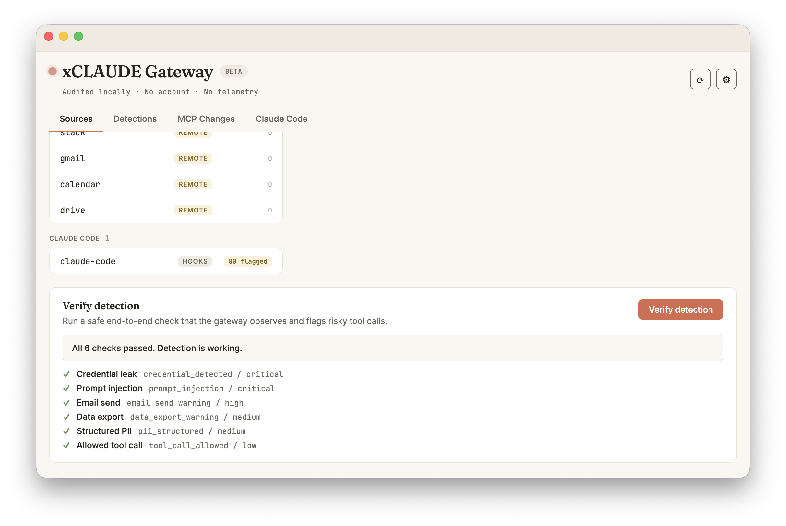
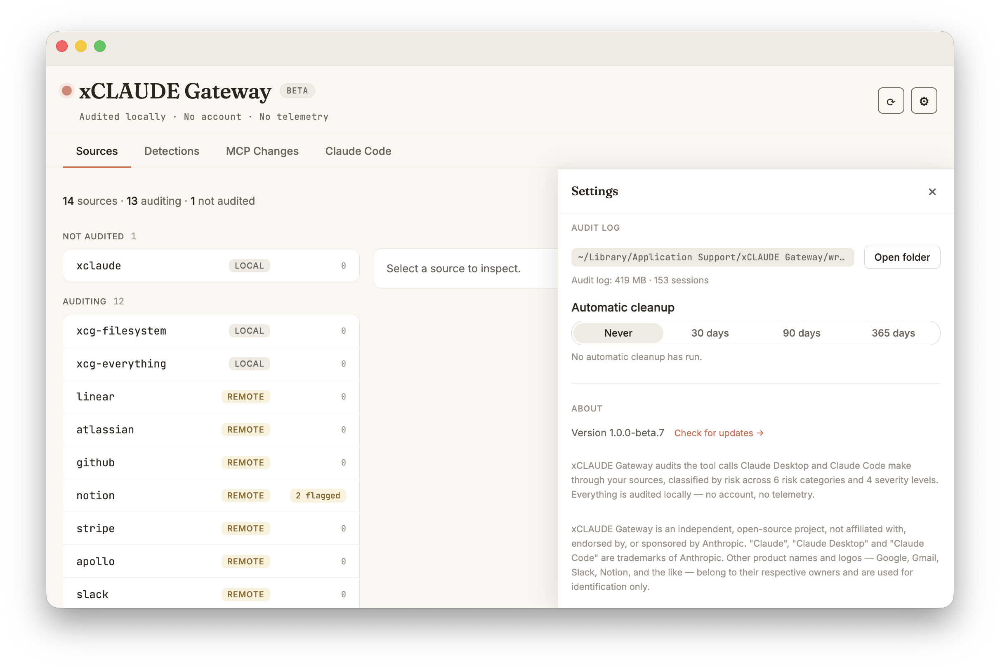

# The audit trail

## How it is stored

- **Append-only.** Each line is one complete JSON envelope, appended to a per-session file under `~/Library/Application Support/xCLAUDE Gateway/wrappers/`. Nothing is rewritten in place. Claude Code events are added to the same directory once the app takes them from the hook's spool.
- **Session files are compacted into day files.** Once a session ends, the compactor appends its lines to a file for that day (UTC) and removes the original. "One file per session" is therefore true while the session is live, not permanently.
- **Durability is page-cache backed.** There is no `fsync` per line — the fd is flushed on clean shutdown. The last writes before a power cut or a kernel panic are not absolutely guaranteed.
- **Claude Code tool calls come from post-execution hooks.** They are recorded once the tool call has completed.
- **Credentials are masked; the rest is verbatim.** Credentials are fully masked and replaced by their type and an HMAC fingerprint, and what a user types in answer to an elicitation is not stored. Everything else is recorded as captured, including PII no detector masked (oversized values are size-truncated and flagged as such). The details are in [SECURITY.md](../SECURITY.md#sensitive-data-in-the-audit-log).
- **Older entries keep their format.** An update never rewrites the trail. Connector changes recorded before [MCP Changes](../README.md#mcp-changes) had its current format appear there under the **Previous format** status option.
- **Nothing is purged by default** (`purgeMode = never`). See [Retention](#retention).

## Verification

After restarting Claude Desktop with at least one wrapped MCP, verify the proxy is running:

```bash
ps aux | grep xcg-proxy | grep -v grep
```

One process per wrapped MCP should appear.

Verify a session log was created:

```bash
ls -lt ~/Library/Application\ Support/xCLAUDE\ Gateway/wrappers/
```

A new JSONL file appears every time Claude Desktop starts with wrapped MCPs. Its name is the session ID (ULID); once the session ends, the compactor folds it into that day's file.

Inspect a log entry:

```bash
tail -1 ~/Library/Application\ Support/xCLAUDE\ Gateway/wrappers/<latest>.jsonl | jq .
```

A typical event:

```json
{
  "v": 1,
  "id": "01KRG8C71M9EXBRJE1T19A1583",
  "ts": "2026-05-13T08:48:40.501Z",
  "session": "01KRG87RPQ59QFBZAK8BXT02DY",
  "mcp": "filesystem",
  "type": "mcp.request",
  "direction": "client_to_server",
  "rpcId": 4,
  "method": "tools/call",
  "params": {},
  "bytes": 117,
  "overheadUs": 322,
  "detection": {
    "category": "tool_call_allowed",
    "severity": "low",
    "findings": []
  }
}
```

The trail stores `"severity": "low"` on normal activity (`tool_call_allowed`), as earlier builds did. The app shows it as NONE and counts it toward no severity; a CSV export leaves its severity empty.

Each response also carries the proxy's own overhead (`overheadUs`) and the server's end-to-end response time (`latencyMs`). A wrapped server's stderr is recorded as separate events.

Open `xCLAUDE Gateway.app` and click the **Detections** tab to see the same events with severity, category, source and time-range filters.

### Verify detection (self-test)

<p align="center"></p>

The Sources tab includes a **Verify detection** button — a safe, self-contained end-to-end check. It runs a synthetic risky payload through the audit pipeline and confirms the event is recorded and flagged. The result shows in the **Sources** tab — the synthetic event does not create a row in Detections — so you can see the detectors working end to end without touching any real connector.

## Retention

<p align="center"></p>

The audit trail is the product, so **nothing is ever deleted by default** (`purgeMode = never`). Session and day logs accumulate in the wrappers directory and stay there until you decide otherwise.

- **A visible size warning.** When the wrappers directory grows past a configured threshold (default **500 MiB**), the app shows a warning in the Detections view. It only warns — auditing continues unchanged.
- **Optional automatic purge by age.** In Settings you can opt in to automatic cleanup of session logs older than **30, 90 or 365 days**. It is **off by default**. Every purge is recorded as a visible `app.retention_purged` event in the audit log — a purge is never silent.
- **Live sessions are never purged.** A session's age is the later of its start time (from the session ULID) and its last write, so an active or recently written session is always kept, even under an aggressive setting.
- **Where the setting lives.** Retention configuration is stored in `settings.json`, next to the wrappers directory under `~/Library/Application Support/xCLAUDE Gateway/`.

Retention mode, current audit log size, and the last cleanup are shown under Settings → Audit log.
