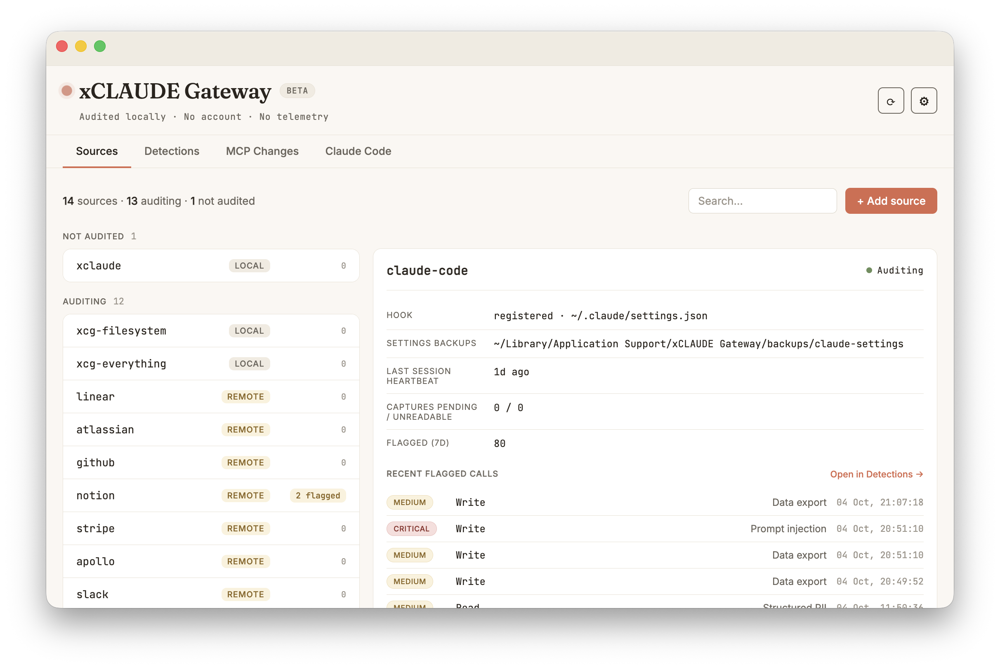

# Claude Code

Claude Code's activity — the tool calls in a session, built-in tools and MCP tools alike — is audited natively through hooks, with its own **Claude Code** view in the app. Detection and credential masking run on this stream as they do on wrapped traffic, keyed by the same salt.

## Installing the hook

Open **Sources**, click **+ Add source** and click **Install hook** on the Claude Code card. To remove it, open the Claude Code source in **Sources** and click **Uninstall**.

xCLAUDE registers its hook in `~/.claude/settings.json` for six events:

| Event | What is recorded |
| --- | --- |
| `PostToolUse` | A tool call and its result, after the call completes (matcher `*`, so every Claude Code tool is covered). |
| `PostToolUseFailure` | A tool call that failed. |
| `SessionStart` | The session's source, model and working directory. |
| `SessionEnd` | The reason the session ended and its working directory. |
| `Elicitation` | An MCP server asking the user for input. |
| `ElicitationResult` | What the user did with that request. |

The two elicitation events are added only when Claude Code 2.1.76 or later is found; earlier versions do not have them.

Hook events are staged in a spool and added to the audit trail by the app. Events accumulate in the spool while the app is closed. The spool is capped: with less than 2 GB free on its disk, or more than 50,000 events waiting, the hook stops staging new events and only counts how many it skipped; the app records that count and shows a notice until it is dismissed. What the spool contains and how it is protected is described in [SECURITY.md](../SECURITY.md#claude-code-hook-staging).

## Keeping the hook in place

<p align="center"></p>

The hook lives in `~/.claude/settings.json`, a file any program — including Claude Code itself — can edit. xCLAUDE does not prevent its removal; it makes it visible: if the hook disappears without an in-app Uninstall, the app warns, offers one-click reinstall, and records an `app.cchook_removed` marker in the audit trail.

When an existing hook install lacks something a newer xCLAUDE version records, the Claude Code tab shows a compact card with **Update hooks** and **Not now**, and Sources shows the pending update. Nothing is changed until you choose **Update hooks**. Install, Update and Uninstall never write through a symlink, or into a file that is not a regular file or is not owned by you.

## Other Claude Code profiles

xCLAUDE installs its hook automatically only in `~/.claude`. If it finds a `~/.claude-*` folder whose `settings.json` has no xCLAUDE hook — for example a profile used with `CLAUDE_CONFIG_DIR` — the Claude Code tab shows a notice with the hook configuration to copy and paste, and a **Dismiss** for that folder. Profiles in other locations are not discovered.

## The Claude Code view

The view shows the claude-code slice of the trail: severity cards, faceted filters (Tool, Session, Status, Project), free-text search, session separators and the request↔response outcome. An MCP tool is shown as the tool alone ("notion-fetch"), with the connector it went to as "via Notion"; the raw name stays on hover, in the detail panel and in search.

Two kinds of row are specific to this path:

- **Server requested input.** An MCP server asked the user for input (elicitation). The row shows the user's action (accepted, declined or cancelled). It is flagged MEDIUM, or HIGH when a field's name or title appears to request a secret, which the MCP spec does not allow in form elicitation. What the user typed is never stored; what is kept of the request is listed in [SECURITY.md](../SECURITY.md#elicitation).
- **Audit trail modification** (`audit_trail_modification`, HIGH). A Claude Code tool call that writes to or deletes xCLAUDE's own data folder: `Write`, `Edit`, `MultiEdit` and `NotebookEdit` by their target path, and `Bash` commands whose arguments target that folder. Reads and MCP tools are not covered.

## Wrapping Claude Code's MCP servers

The native Claude Code audit already records MCP tool calls and their results. Wrapping a server adds what only the protocol level can show: the server's advertised surface (`tools/list` and its siblings, which feed [MCP Changes](../README.md#mcp-changes)), the server's stderr, and server-initiated traffic such as `roots/list` requests.

Setup is manual for now (there is no Install button for Claude Code's MCP servers yet). Register the wrapped server with `claude mcp add-json` — don't edit Claude Code's config files by hand:

```
claude mcp add-json <name> '{"type":"stdio","command":"/Users/<you>/Library/Application Support/xCLAUDE Gateway/bin/xcg-proxy","args":["stdio","--wrap","<original-command>","--name","<name>","--","<original-args...>"],"env":{}}'
```

Replace `/Users/<you>` with your actual home directory — the quoted JSON will not expand `~` or `$HOME`. Then start a new Claude Code session. The `bin/xcg-proxy` path is a stable symlink the app maintains; it runs on the app's own runtime, so no Node installation is required. This registers the server for the current project; add `--scope user` to wrap it across all your projects. To revert, `claude mcp remove <name>` and re-add the server with its original command.

Notes: only local stdio servers can be wrapped — Claude Code's claude.ai-managed connectors are brokered remotely and never reach your machine, same as Claude Desktop's native Connectors. With both the wrapper and the native Claude Code audit active, each call on a wrapped server is recorded by both sources; the two records are correlated by Claude Code's tool-use ID: paired rows carry a link indicator in Detections, and the event detail names the other source.
