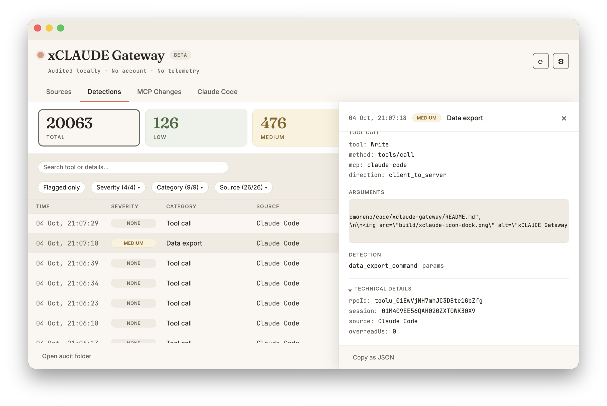

# Detections

Every recorded tool call is classified. A call that matches no detector is recorded as `tool_call_allowed` — normal activity, shown as NONE — which is the "everything is normal" line, not an absence of analysis.

## Categories

| Category | Severity | What it detects | Path |
| --- | --- | --- | --- |
| `credential_detected` | CRITICAL | Known formats of API keys (Anthropic, OpenAI, GitHub, AWS, and similar). | Both |
| `prompt_injection` | CRITICAL | Four families of injection / jailbreak phrasing: instruction override ("ignore all previous instructions"), role override ("act as an unrestricted…"), system-prompt extraction ("reveal your system prompt") and jailbreak markers ("DAN mode", "do anything now"). | Both |
| `email_send_warning` | HIGH / MEDIUM | Imperative requests to send email in tool text, and send-semantics tool calls (see below). | Both |
| `audit_trail_modification` | HIGH | A Claude Code tool call that writes to or deletes xCLAUDE's own data folder (see [claude-code.md](claude-code.md#the-claude-code-view)). | Claude Code |
| `protocol_tripwire` | HIGH / MEDIUM / LOW | The shape of a JSON-RPC exchange rather than its content (see below). | Proxy; in Claude Code, elicitation only |
| `data_export_warning` | MEDIUM | Imperative requests to export data. | Both |
| `pii_structured` | MEDIUM | Well-formed PII shapes, checksum-confirmed where the format has a checksum; digit-only formats also require a nearby context keyword (see below). | Both |
| `pii_detected` | LOW | Named-entity PII — people, organizations, locations — found by the on-device NER model. Async enrichment; runs on requests only. | Proxy |
| `tool_call_allowed` | NONE | Normal activity: emitted for every call that matches none of the above. Counted in no severity total. | Both |

**Both directions.** The five text detectors (`credential_detected`, `prompt_injection`, `email_send_warning`, `data_export_warning`, `pii_structured`) scan tool-call results as well as outgoing arguments — a secret, an injected instruction or a checksum-valid identifier arriving in a server's response is classified too. Named-entity PII runs on requests only.

**`email_send_warning` branches.** An AI-executed send (`send`/`reply`/`forward` tools) flags at HIGH — an action that deserves human attention regardless of intent; an AI-composed draft (`draft`/`compose` tools) flags at MEDIUM, since a draft is content one click away from sent.

**`pii_structured` shapes.** Fifteen rules: emails, IBANs (mod-97, country code checked against the IBAN registry), credit cards (Luhn, first digit in the ISO/IEC 7812 card ranges), US SSNs, UK National Insurance and NHS numbers, Spanish DNI/NIE, E.164 phone numbers, passport MRZ line 2 (ICAO 9303 TD3), French NIR, Italian codice fiscale (standard form; omocodia variants are out of scope), Dutch BSN, German Steuer-ID and Portuguese NIF. A regex preselects each candidate and, for every shape that carries one, a checksum confirms it. The three digit-only formats (Dutch BSN, Portuguese NIF, UK NHS) additionally require their context keyword near the match (BSN/NIF/NHS and equivalents) — a bare digit run that merely passes a mod-11 checksum is far more often a machine number than an identifier. Obviously functional email addresses (noreply@ local parts, example/invalid domains, GitHub's users.noreply host) are excluded. Emails and E.164 phone numbers have no checksum and match on their pattern alone. Findings record the matched type only — never the datum itself.

**Named-entity PII is early stage.** The transformers.js NER enrichment records persons, organizations and locations found in tool-call payloads alongside the main detector chain. The model is bundled with the app and never downloaded at runtime. It complements the checksum-based `pii_structured` detector and is not part of the synchronous detector chain.

## Protocol tripwires

`protocol_tripwire` looks at what kind of message crossed the wire, not at its content:

| Tripwire | Severity | When |
| --- | --- | --- |
| Server request | MEDIUM | A server sends the client a request other than `ping` or `roots/list` — for example an elicitation or a sampling request. In Claude Code, an elicitation that appears to ask for a secret is HIGH. |
| `input_required` | MEDIUM | A server response whose result asks for further input. |
| Unknown method | LOW | A request method outside the MCP methods xCLAUDE knows, once per process. |
| Unknown protocol version | LOW | A protocol version xCLAUDE does not know, once per process. |

In the detail panel, a server request is shown as **Request** and an `input_required` response as **Response**, not as a tool call.

## In the app

- **NONE and Flagged only.** Normal activity shows NONE. **Total** counts all activity; LOW to CRITICAL count findings only. **Flagged only** (off by default, in Detections and Claude Code) narrows the list to the events a detector matched. In ordinary use most events are normal activity: Claude's own model refuses many sensitive operations before any tool call is issued.
- **SOURCE.** The column names the source itself — a connector's catalog name (Notion, Google Drive…), a wrapped server's own name, or Claude Code, which is everything its hook recorded, MCP calls included — and the Source filter lists the same names.
- **Export.** The filtered list exports as JSONL — the record exactly as written — or CSV, which leaves the severity column empty for normal activity.

Changes to what a connector advertises are not detections; they are in [MCP Changes](../README.md#mcp-changes).
