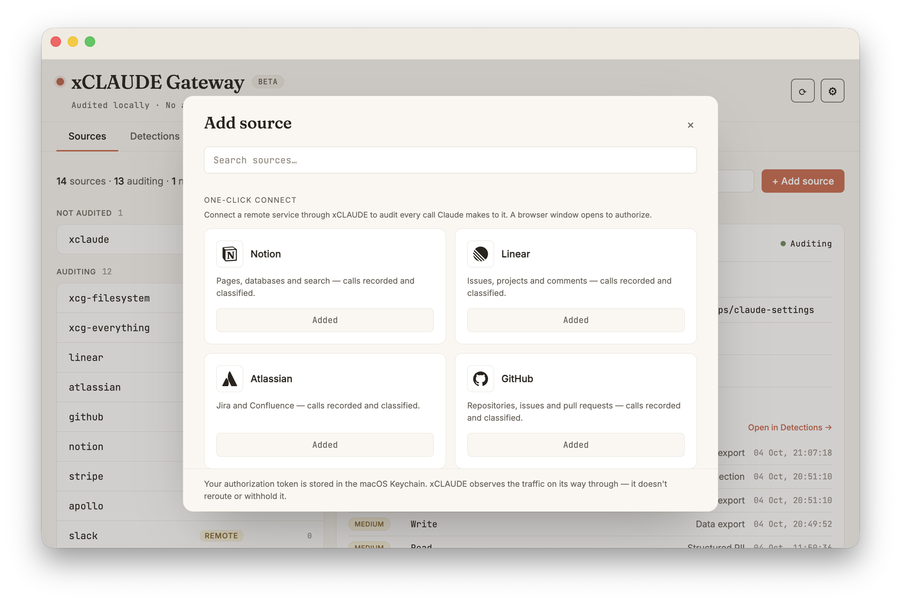
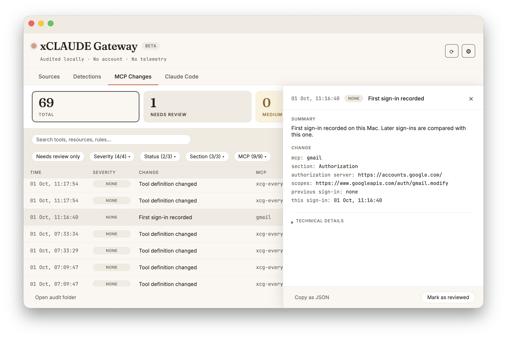
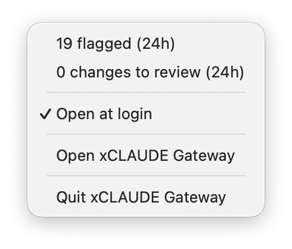
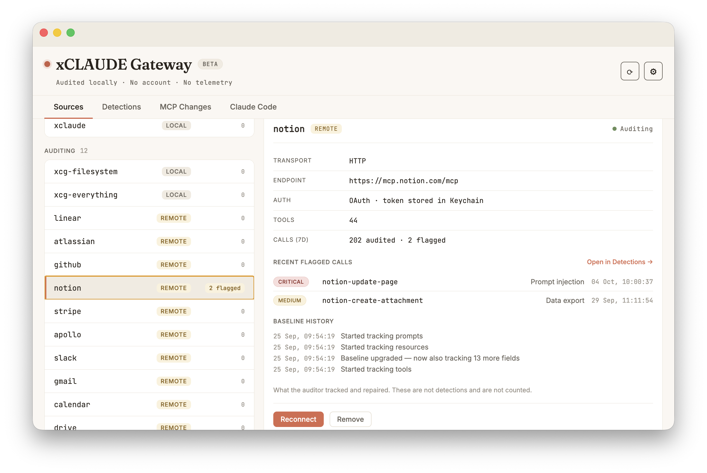

# Remote connectors

xCLAUDE can audit remote MCP services — Notion, Linear, Atlassian, GitHub, Stripe, Apollo, Slack, Gmail, Google Calendar and Google Drive today — by acting as your connection to them, instead of Claude Desktop connecting directly.

To audit a service this way:

1. If you already have it enabled as a native Connector in Claude Desktop, disconnect it there first. xCLAUDE audits its own bridged connection, not the native one.
2. In xCLAUDE, open the **Sources** tab and click **+ Add source** to open the connector gallery. Pick the service and click **Connect**. (Not listed? Use the **Request a connector** link.)
3. A browser window opens to authorize the service (standard OAuth). Approve it; the tab will say the login is complete.
4. Restart Claude Desktop. Claude now reaches the service through xCLAUDE, and its calls are recorded and classified like any other MCP traffic.

Your OAuth tokens are stored in the macOS Keychain, not in plain text. xCLAUDE never sees your password. The traffic still reaches the provider — xCLAUDE observes it on its way through, it does not withhold or reroute it. If a request cannot be forwarded to the remote server (a network or authorization failure), the proxy answers the client with a JSON-RPC error for that request's id, so the client does not wait for a response that will never come. That error response is recorded in the audit trail, identifiable by error code -32001 and a message starting with `xcg-proxy:`. If a connector disappears from your Claude Desktop config outside the app — another program rewrote the file — xCLAUDE flags it within seconds and offers to re-add it.

## Sign-ins

Each OAuth sign-in that exchanges an authorization code is recorded in [MCP Changes](../README.md#mcp-changes) and compared with the connector's previous sign-in: the authorization server, the resource and the granted permissions.

- A different authorization server is flagged HIGH and expanded permissions MEDIUM, each with a macOS notification.
- Reduced permissions and a different resource are recorded without a severity.
- Token refreshes are not sign-ins and are not compared.

OAuth credentials are bound to the authorization server that issued them. Signing in rejects authorization server metadata whose issuer does not match, and a callback whose `iss` does not match (RFC 8414, RFC 9207); a connector that is already running records a metadata mismatch instead of failing. What the sign-in record contains, and what it never contains, is listed in [SECURITY.md](../SECURITY.md#oauth-sign-ins).

## Re-login alerts

If a connector's authorization expires or is revoked, xCLAUDE flags a re-login alert on that connector, with a macOS notification, and the menu bar shows how many connectors need re-login. A connector that already needs re-login when the app starts is announced once; failing calls do not clear the alert, only a successful response does. Reconnect it from the connector's inspector in **Sources** and restart Claude Desktop to resume auditing. **Reconnect** requests the same permissions as the original connection.

The alerts need the app running. **Open at login** (Settings, or the menu bar; off by default) starts xCLAUDE in the menu bar when you log in.

## Connector inspector

Selecting a connector in **Sources** shows its transport and endpoint, how it authenticates, its recent flagged calls and its baseline history from [MCP Changes](../README.md#mcp-changes), with a warning when a snapshot could not be assembled or its baseline file could not be read. **Reconnect** and **Remove** are at the bottom.

For a local server, the inspector also shows whether its version source is pinned or mutable — npx or uvx without an exact version, or Docker without a digest. The version source is informational, not a detection.

## GitHub

Connects via standard OAuth. xCLAUDE requests a narrow scope set — `repo`, `read:org`, `read:user` — rather than the full set the server advertises.

## Slack

Slack needs a one-time app setup. Click **Set up…** on the Slack card: one click opens Slack with the app pre-configured, you pick your workspace and create it, then paste its **Client ID** into the wizard, which stores it in the macOS Keychain. Your workspace admin may need to approve the app before you can connect. Slack asks you to re-authorize about once a month — that is how Slack designed it, not an error.

## Google services

Gmail, Google Calendar and Google Drive use your own OAuth client. See [google-connectors.md](google-connectors.md).
